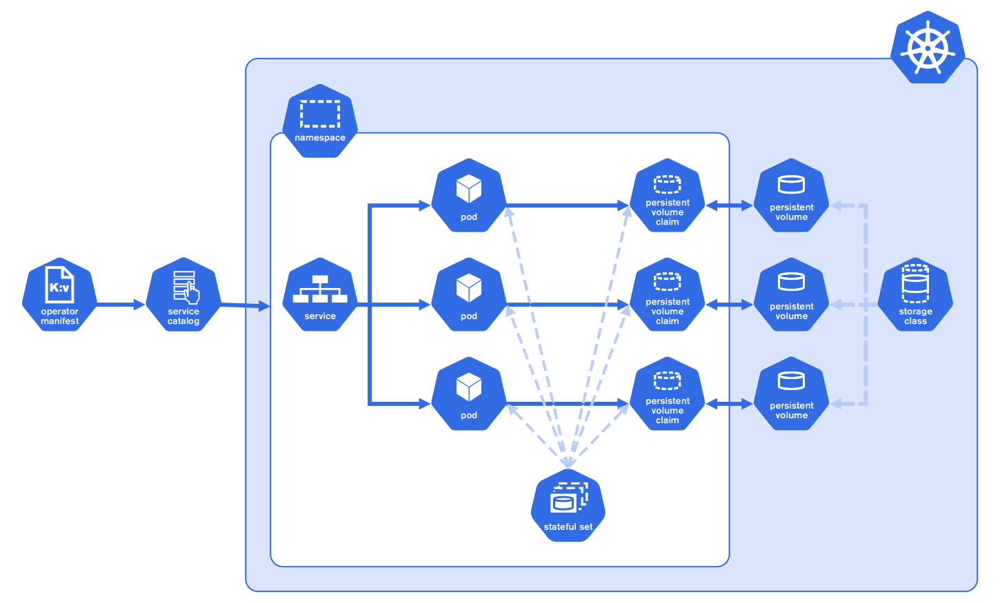

# Rocketchat kubernetes cluster deployment

This project contains configuration and manual to deploy rocketchat and its services on kubernetes cluster.

## Services

| In this section each service and its specification is defined.

1. Rocketchat:
   > **[rocketchat-deployment.yaml](rocketchat-deployment.yaml)** contains deployment of rocketchat container on kubernetes Pod. the Pod uses image from **rocket.chat:5.4.0** to deploy a container inside it. ports 80 and 9458 exposed in container are for web and prometheus exporter endpoint. **rocketchat-service.yaml** contains configuration for exposing rocketchat service ports 80 and 443 as LoadBalancer type in kubernetes. it ensures to give access to it outside of kubernetes network.
2. mongodb:
   > **[mongo.yaml](mongo.yaml)** contains kubernetes resource of kind **MongoDBCommunity** which defines a replica set for management of instances, pod for deployment of mongod and mongo-agent container, service with type ClusterIP for networking and connection management between instances and other services and a secret for database admin password. the resource configuration has specifications for PersistenceVolumeClaim in it which the operator creates and mangages storage for the mongodb based on this config.
3. minio:
   > **[minio.yaml](minio.yaml)** contains configuration for deploying minio object storage service. it specifies kubernetes replica set with template specs for pod creation. the container environment variables are embedded in the config file that can be extraced as a kubernetes ConfigMap resource.
4. > **[mongo-cron-backup.yaml](mongo-cron-backup.yaml)** contains cron job in order to backup rocketchat database daily. it connects to rocketchat mongodb, dumps database as a single archive and then puts the archive with its backup time into an s3 storage.
5. > **[rancher/local-path-storage.yaml](rancher/local-path-storage.yaml)** Local path dynamic provisioner configured bt Rancher

### Persistence Storage

In this template the persistent volume claim templates requests 20Gi for mongodb data volume and 10Gi for minio object storage.

## Deployment using mongodb kubernetes operator

### What is mongodb kubernetes operator

It simplifies the deployment of mongodb instances in a kubernetes cluster with supporting different kind of deloyments such as single instance, replica set and sharded cluster. with usage of new defined CustomResource MongoDBCommunity, we can configure its deployment. In MongoDBCommunity kind the service, replica set, container template config and etc. are managed through new API added to the kubernetes cluster. The mongodb-kuberenetes-operator pod has the responsibility to manage the new added APIs to the cluster.
iIthis project the community version of the operator is used.
From official documentation of mongodb kubernetes operator:
The MongoDB Enterprise Kubernetes Operator translates the human knowledge of creating a MongoDB instance into a scalable, repeatable, and standardized method. Kubernetes needs help creating and managing stateful applications like databases. It needs to configure the network, persist storage, and dedicate computing capacity without additional human effort on each container.

The Kubernetes Operator manages the typical lifecycle events for a MongoDB cluster: provisioning storage and computing power, configuring network connections, setting up users, and changing these settings as needed. It accomplishes this using the Kubernetes API and tools.

You provide the Operator with the specifications for your MongoDB cluster. The Operator uses this information to tell Kubernetes how to configure that cluster including provisioning storage, setting up the network connections, and configuring other resources.



The MongoDB Enterprise Kubernetes Operator works together with MongoDB Cloud Manager or Ops Manager, which further configures to MongoDB clusters. When MongoDB is deployed and running in Kubernetes, you can manage MongoDB tasks using Cloud Manager or Ops Manager.

You can then deploy MongoDB databases as you deploy them now after the cluster is created. You can use the Cloud Manager or Ops Manager console to run MongoDB at optimal performance.

### Configuration of mongodb kubernetes operator

In order to deploy mongodb kubernetes operator run the commands below:

1. ensure the git submodule of mongodb-kubernetes-oprator is pulled form the original repo with command

    ```bash
    git submodule update --init
    ```

    or

    ```bash
    git pull --recurse-submodules
    ```

    or clone the repo with command

    ```bash
    git clone --recurse-submodules
    ```

2. Create namespace <namespace>

   ```bash
   kubectl create namespace <namespace>
   ```

3. apply the crds, rbac and operator from mongodb-kubernetes-oprator/config

    ```bash
    kubectl apply -n <namespace> -k mongodb-kubernetes-oprator/config/default
    ```

4. Set namespace on line 7 of [cluster_role_binding.yaml](mongodb-kubernetes-operator/deploy/clusterwide/cluster_role_binding.yaml), then run the following command to create cluster-wide roles and role-bindings in the default namespace

    ```bash
    kubectl apply -f mongodb-kubernetes-oprator/deploy/clusterwide
    ```

5. verify that the resources have been created:

    ```bash
    kubectl get role mongodb-kubernetes-operator --namespace <namespace>

    kubectl get rolebinding mongodb-kubernetes-operator --namespace <namespace>

    kubectl get serviceaccount mongodb-kubernetes-operator --namespace <namespace>
    ```

6. In order to use local StorageClass persistent volumes set path for provisioning on line 45 of [local-path-storage.yaml](rancher/local-path-storage.yaml)
   Local Path Provisioner provides a way for the Kubernetes users to utilize the local storage in each node. Based on the user configuration, the Local Path Provisioner will create hostPath based persistent volume on the node automatically. It utilizes the features introduced by Kubernetes Local Persistent Volume feature, but make it a simpler solution than the built-in local volume feature in Kubernetes.
   In this setup, the directory /var/lib/docker/kube-local will be used across all the nodes as the path for provisioning (a.k.a, store the persistent volume data). The provisioner will be installed in chat namespace by default.
   > the provisioner repository ref [Rancher Local Path Provisioner](https://github.com/rancher/local-path-provisioner)

7. comment out bitnami mongodb cluster helm charts config and uncomment mongo.yaml in [kustomization.yaml](kustomization.yaml), then deploy services with running command:

   ```bash
   kubectl apply -n <namespace> -k .
   ```

   or

   ```bash
   ./kubeapply
   ```

## Deployment using bitnami mongodb helm charts

1. first ensure mongo.yaml is commented out and helm charts config of bitnami mongodb is available in [kustomization.yaml](kustomization.yaml)
2. apply with command:

   ```bash
   kubectl apply -n <namespace> -k .
   ```

   or

   ```bash
   ./kubeapply
   ```

## Post Deployment

TODO. need completion...

## Useful links for complete documentation

i. [Mongodb Kubernetes Oprator Docs](https://www.mongodb.com/docs/ii.kubernetes-operator/master/)

ii. [Mongodb Kubernets Oprator Community Github](https://github.com/mongodb/mongodb-kubernetes-operator)

iii. [MongoDB® packaged by Bitnami Helm Charts](https://bitnami.com/stack/mongodb/helm)

iv. [MongoDB® packaged by Bitnami Helm Charts Github](https://github.com/bitnami/charts/tree/master/bitnami/mongodb)

v. [MongoDB® packaged by Bitnami Docker Github](https://github.com/bitnami/bitnami-docker-mongodb)

vi. [Rancher Local Path Provisioner](https://github.com/rancher/local-path-provisioner)

vii. [HAProxy Ingress](https://haproxy-ingress.github.io/)

viii. [HAProxy Ingress Helm Chart Github](https://github.com/haproxy-ingress/charts/tree/master/haproxy-ingress)
